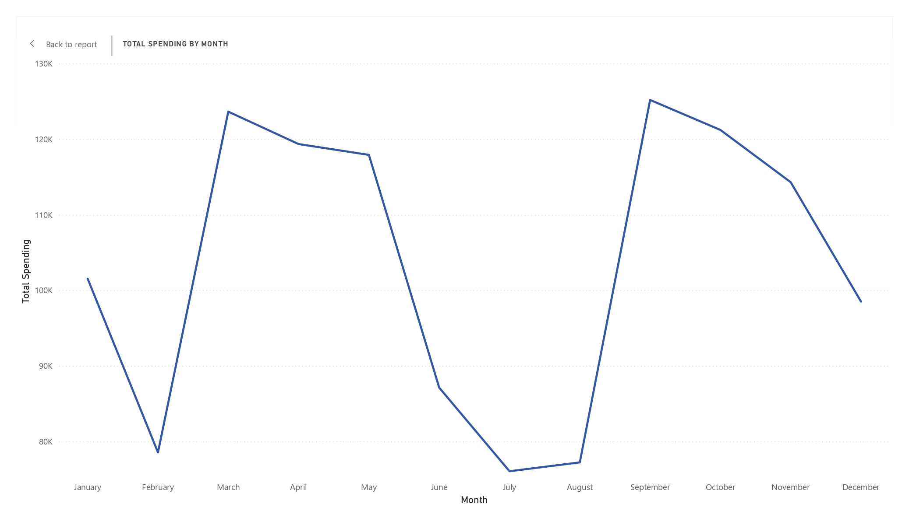
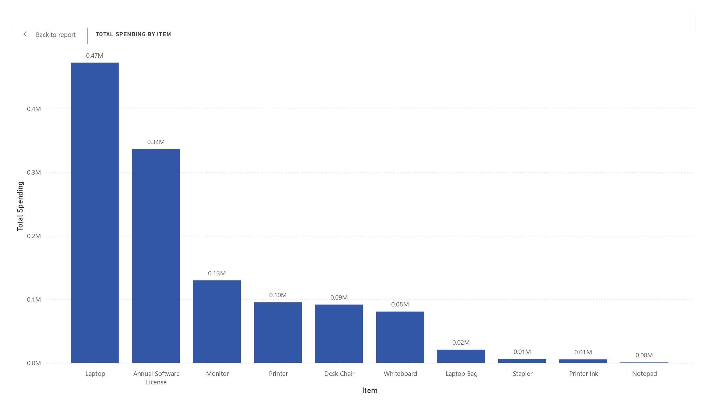
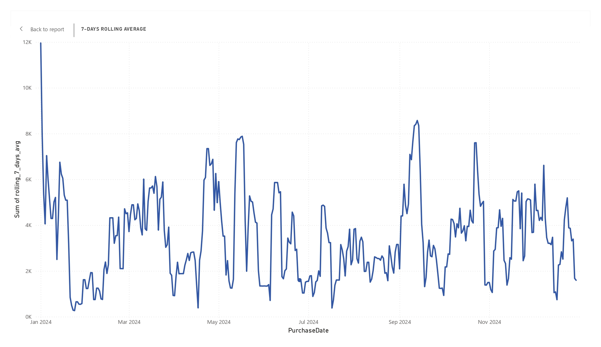
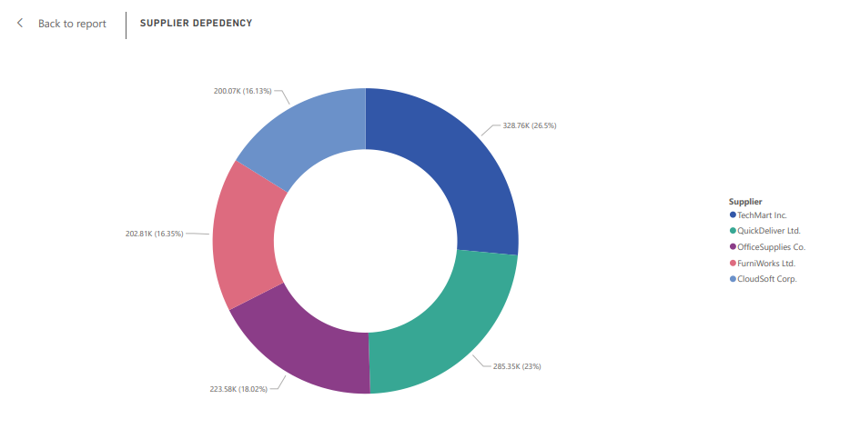

# 🏢 Company Spending Analysis Dashboard (2024)

## 📌 Project Overview | Ringkasan Proyek

This project presents a detailed spending analysis of a fictional company for the year 2024. The main goal is to uncover purchasing patterns, highlight supplier dependencies, and support better data-driven procurement decisions.

Key focus areas:
- Ensuring data quality
- Identifying high-spending items and categories
- Monitoring spending trends over time
- Detecting potential supplier concentration risk
- Providing actionable business insights

--

Proyek ini menyajikan analisis pengeluaran yang mendalam dari sebuah perusahaan fiktif untuk tahun 2024. Tujuan utamanya adalah untuk mengungkap pola pembelian, menyoroti ketergantungan terhadap pemasok, dan mendukung pengambilan keputusan pengadaan yang lebih baik berbasis data.

Fokus utama:

- Memastikan kualitas data
- Mengidentifikasi item dan kategori dengan pengeluaran tertinggi
- Memantau tren pengeluaran dari waktu ke waktu
- Mendeteksi potensi risiko konsentrasi pemasok
- Memberikan wawasan bisnis yang dapat ditindaklanjuti


---

## 📂 Dataset Source | Sumber Dataset

📥 Original dataset from [Kaggle - Company Spending](https://www.kaggle.com/datasets)

---

## 🧾 Dataset Overview | Ringkasan Dataset

| Column         | Description                           |
|----------------|---------------------------------------|
| TransactionID  | Unique transaction identifier         |
| PurchaseDate   | Date of transaction                   |
| ItemName       | Name of the item purchased            |
| Category       | Item category                         |
| Quantity       | Number of items bought                |
| UnitPrice      | Price per unit                        |
| TotalCost      | Total cost (Quantity × UnitPrice)     |
| Supplier       | Supplier name                         |
| Buyer          | Person responsible for the purchase   |

---

## 📌 Key Objectives | Tujuan Utama

- Validate and clean procurement data.
- Identify top spending categories and items.
- Monitor supplier concentration risk.
- Evaluate spending trends over time using rolling metrics.
- Detect anomalies in financial transactions.

--

- Membersihkan dan validasi data pengadaan.
- Mengidentifikasi kategori dan item dengan pengeluaran terbesar.
- Memantau risiko ketergantungan pada pemasok.
- Mengevaluasi tren pengeluaran dari waktu ke waktu menggunakan metrik bergulir.
- Mendeteksi anomali pada transaksi finansial.

---

## 📈 Visualizations | Visualisasi

1. **📆 Monthly Total Spending**  
   Highlights fluctuations in monthly expenditure, useful for understanding budgeting cycles.  
   Menunjukkan fluktuasi pengeluaran bulanan yang berguna untuk memahami siklus anggaran.

   

2. **📦 Top Spending by Item**  
   Displays the most expensive items purchased during the year.  
   Menampilkan item dengan total pembelian tertinggi selama tahun berjalan.

   

3. **📊 7-Day Rolling Average Spending**  
   Smooths daily variance to reveal underlying spend patterns.  
   Meratakan variasi harian untuk menunjukkan pola pengeluaran yang konsisten.

   

4. **📉 Supplier Dependency**  
   Assesses procurement concentration by supplier to identify potential risk areas.  
   Menilai konsentrasi pengadaan berdasarkan pemasok untuk mengidentifikasi potensi risiko.

   

---

## 🔍 Business Insights | Wawasan Bisnis

### 🧾 1. High-Cost Items Dominate Spending  
Several high-ticket items such as **Laptop** and **Annual Software License** represent a large portion of spending. These items were also detected in anomaly detection, appearing more than **2 standard deviations above the average cost**—a natural result of their inherently high price compared to other items.

Beberapa item bernilai tinggi seperti **Laptop** dan **Annual Software Lincese** menyumbang sebagian besar pengeluaran. Item ini juga terdeteksi dalam analisis anomali, berada lebih dari **2 standar deviasi di atas rata-rata**—hal ini wajar karena harganya memang jauh lebih mahal dibandingkan item lainnya.

---

### 📦 2. Supplier Dependency Risk  
Two suppliers control approximately **49.5%** of the company’s total spend (26.5% and 23% respectively). This concentration exposes the company to operational risks in case of supplier disruption.

Dua supplier menguasai sekitar **49.5%** dari total pengeluaran perusahaan (masing-masing 26.5% dan 23%). Konsentrasi ini meningkatkan risiko operasional jika terjadi gangguan pada supplier utama.

---

### 📈 3. Spending Fluctuation Across Months  
Spending varies significantly across months, with spikes occurring in **March** and **September**. This suggests the presence of seasonal purchasing behavior or bulk buying trends.

Pengeluaran bervariasi cukup signifikan setiap bulannya, dengan lonjakkan yang terjadi pada bulan **Maret** dan **September**. Hal ini bisa mengindikasikan perilaku pembelian musiman atau pembelian dalam jumlah besar pada waktu tertentu.

---

### 📉 4. Clearer Trends with 7-Day Rolling Avg  
The 7-day rolling average helps smooth out daily fluctuations and enables more intuitive monitoring of short-term budget behavior, suitable for operational dashboards.

7-days rolling average membantu meratakan fluktuasi harian dan memudahkan pemantauan tren pengeluaran jangka pendek, cocok untuk dashboard operasional.

---

## 🛠️ Tech Stack

| Tool / Tech               | Role                                |
|---------------------------|-------------------------------------|
| MySQL                     | Data querying and manipulation      |
| SQL CTE + Window Function | 7-Days Rolling averages, MoM growth |
| Power BI                  | Visualization (Charts)              |
| Markdown + GitHub         | Documentation & Publishing          |

---

## 🧭 Folder Structure | Struktur Folder

```
company-spending-analysis/
├── sql/
│   └── company_spending_analysis.sql
├── visualization/
│   ├── Company Spending Analysis 2024.pbix
│   └── monthly_spending.jpg
│   └── rolling_avg.jpg
│   └── top_items.jpg
│   └── supplier_dependency.png
├── data/
│   └── spend_analysis_dataset.csv
└── README.md
```

---

##  🙋‍♂️ Connect With Me

Hi, I'm Firmansyah — aspiring data analyst with a background in IT and a passion for turning data into business insights. This project is part of my continuous learning journey. 

🌐 LinkedIn: https://www.linkedin.com/in/firmansyah-241482344  
📁 Email: firmansyah3034@gmail.com

